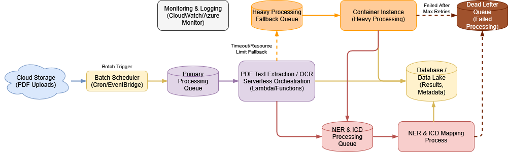

# pdf2icd – Proof-of-Concept for Disease Mention Extraction and ICD Mapping from Clinical PDFs

This repository contains a functional proof-of-concept for extracting disease mentions from PDF documents and mapping them to ICD codes using a combination of PDF text extraction, OCR, biomedical NER, and UMLS-derived dictionary matching. The implementation is modular, fully containerizable, and tested with unit tests.

## Project Context

This proof-of-concept was developed as part of a technical challenge involving automated extraction of disease descriptions from clinical PDFs and mapping those descriptions to ICD codes.
The goal was to design and implement a modular, reproducible workflow covering PDF text extraction, OCR, biomedical NER, terminology normalization, and dictionary-based ICD mapping.

During development, I used AI tools (ChatGPT-4.1 and Claude Sonnet 4) as research and prototyping assistants to explore alternative approaches, compare OCR and NER options, and generate supporting materials such as architecture diagrams.
Final design decisions, code implementation, and verification were performed independently, following my engineering standards for clarity, maintainability, correctness, reproducibility, and modular design.
The tooling served as an aid for evaluating trade-offs, not as a substitute for engineering judgment.

The original problem statement for this challenge is provided in [PROBLEM_STATEMENT.md](PROBLEM_STATEMENT.md).
My responses to the statement are included in [responses.pdf](responses.pdf).

This repository is preserved for archival and portfolio purposes and represents the final state of the submitted
proof-of-concept.

---

## Features

* **PDF text extraction** using Poppler utilities (`pdftotext`, `pdfimages`)
* **OCR support** via [ocrmypdf](https://github.com/ocrmypdf/OCRmyPDF) for scanned/image-based PDFs
* **Biomedical NER** using a spaCy model (`en_ner_bc5cdr_md`)
* **Dictionary-based matching** for disease → CUI → ICD-10-CM mapping (UMLS license required for rebuilding assets)
* **CLI workflow** for end-to-end processing of a single PDF into a TSV output
* **Asset preparation** for generating JSON lookup tables (`term_to_cuis.json`, `cui_to_icd.json`) from UMLS RRF files
* **Type hints, logging, and unit tests** for maintainability and reproducibility
* **Dockerized build** for easy deployment

---

## Architecture (Proposed)



**Processing steps**
1. PDFs land in cloud storage.
2. Batch scheduler enqueues work on the **Primary Processing Queue**.
3. Serverless orchestration performs text extraction and OCR as needed.
4. Jobs that exceed serverless limits go to a **Heavy Processing Fallback Queue**.
5. A container instance handles heavy/long-running processing.
6. Extracted text is posted to the **NER & ICD Processing Queue**.
7. NER runs and mentions are mapped to CUIs → ICD codes.
8. Results and metadata are written to the database/data lake.
9. After max retries, failures go to the **Dead Letter Queue**.
10. Monitoring & logging capture metrics and alerts across all stages.

---

## Repository Structure

```
pdf2icd/
├── assets/                # Prebuilt mapping assets (CUI → ICD, term → CUIs)
├── disease_matcher.py     # Dictionary-based matching of mentions to CUIs/ICD codes
├── disease_ner.py         # spaCy-based biomedical NER for disease extraction
├── logs.py                # Project-wide logging
├── ocr.py                 # OCR utilities using ocrmypdf
├── poppler.py             # Poppler-based PDF text extraction and image page detection
├── prepare_assets.py      # Build mapping assets from UMLS RRF files
├── utils.py               # Text normalization, mapping loaders, JSON/TSV helpers
└── workflow.py            # End-to-end pipeline (text extraction → NER → ICD mapping → TSV output)
tests/                     # Unit tests for core modules
Dockerfile                 # Container build for the pipeline
pyproject.toml             # Poetry-based dependency management
```

---

## Prerequisites

* **Python:** 3.12 (managed via Poetry)
* **Docker:** Required for containerized builds

### For Local Development

The following system dependencies must be installed locally:

* **Poppler utilities:** `poppler-utils` package (provides `pdftotext` and `pdfimages`)
* **OCR stack:** `ocrmypdf`, `tesseract-ocr`, `unpaper`

#### Ubuntu/Debian Installation

```bash
sudo apt-get install -y poppler-utils ocrmypdf tesseract-ocr unpaper
```

**Note:** All dependencies are automatically installed in the Docker image.

---

## Preparing UMLS Mapping Assets (Required Before Docker Build / Local Development)

⚠️ **Important:** This PoC cannot function without UMLS-derived mapping assets. Due to licensing restrictions, these assets are **not included** in this repository. You must build them yourself before attempting a Docker build or running the workflow.

1. **Obtain a UMLS license**
   Register at the [UMLS Terminology Services](https://uts.nlm.nih.gov/) site and accept the license agreement.

2. **Download UMLS release files**
   Specifically, obtain the following RRF files:
   * `MRCONSO.RRF`
   * `MRSTY.RRF`

3. **Build mapping assets locally**
   Run the asset preparation script:
   ```bash
   poetry run prepare_assets \
       --mrsty path/to/2025AA/META/MRSTY.RRF \
       --mrconso path/to/2025AA/META/MRCONSO.RRF \
       --output-dir pdf2icd/assets
   ```

   This generates:
   * `term_to_cuis.json` – normalized term → CUIs
   * `cui_to_icd.json` – CUI → ICD-10-CM codes

4. **Verify assets**
   Ensure both JSON files exist under `pdf2icd/assets/`.

5. **Proceed with Docker build**
   Only after the assets are in place:
   ```bash
   docker build -t pdf2icd:latest .
   ```

---

## Building the Docker Image

From the project root (after UMLS assets are prepared):

```bash
docker build -t pdf2icd:latest .
```

This will produce a container image with all dependencies installed, including Poppler and ocrmypdf.

---

## Running the Workflow

### Local Execution (Using Poetry)

1. Install dependencies:

   ```bash
   poetry install
   ```

2. Run the workflow on a sample PDF:

   ```bash
   poetry run workflow --pdf path/to/input.pdf --output output.tsv
   ```

3. Options:

   * `--ner-model` – Specify a spaCy NER model (default: `en_ner_bc5cdr_md`)
   * `--fuzzy-limit` – Number of fuzzy matches per mention (default: 3)
   * `--fuzzy-threshold` – Fuzzy matching score threshold (default: 85)

---

### Container Execution

Assuming you built the image as `pdf2icd:latest`:

```bash
# Example command
docker run --rm -v $(pwd):/app pdf2icd:latest /bin/bash -c \
    'poetry run workflow --pdf /app/tests/data/input/mixed_data.pdf --output /app/output.tsv'
```

---

## Testing

The repository includes unit tests for all major modules under the `tests/` folder.

### Run All Tests

**Local execution:**
```bash
poetry run pytest -v
```

**Docker execution:**
```bash
docker build --target test -t pdf2icd:test .
```

The Docker `test` target will automatically run the full test suite as part of its build process.

### Notes on Testing

* **Memory usage:** Running the full test suite (especially with OCR and spaCy) can be memory-intensive. It is recommended to use a machine with at least **16 GB of RAM**.
* **OCR tests:** OCR-related tests rely on Poppler and ocrmypdf binaries. These are installed automatically in the Docker image.

---

## Key Modules

| Module               | Purpose                                                               |
| -------------------- | --------------------------------------------------------------------- |
| `poppler.py`         | Extracts embedded text and identifies image pages using Poppler tools |
| `ocr.py`             | Performs OCR on specified pages using ocrmypdf                        |
| `disease_ner.py`     | Extracts disease mentions using spaCy biomedical NER                  |
| `disease_matcher.py` | Matches disease mentions to UMLS CUIs and ICD codes (exact & fuzzy)   |
| `prepare_assets.py`  | Builds mapping assets (`term_to_cuis.json`, `cui_to_icd.json`)        |
| `utils.py`           | Text normalization, JSON/TSV helpers, and asset loaders               |
| `workflow.py`        | Orchestrates the full pipeline (PDF → text → NER → ICD → TSV)         |

---

## Known Limitations

* **OCR accuracy** drops significantly for handwritten notes or low-quality scans.
* **ICD mapping** requires UMLS-derived assets that must be built locally under a valid license.
* **Resource requirements:** spaCy models and OCR processes may require substantial RAM making queue-driven processing preferable for production cloud deployments.

---

## License and Dependencies

* The proof-of-concept uses **permissive open-source tools** (Poppler, ocrmypdf, spaCy).
* UMLS-derived lookup tables require a valid **UMLS license** if rebuilt from RRF sources.
* Libraries with restrictive licenses (e.g., PyMuPDF) were avoided.

---

## Future Enhancements

* Integration of official **ICD-10-CM datasets** from the [CDC FTP site](https://ftp.cdc.gov/pub/Health_Statistics/NCHS/Publications/ICD10CM/2026/)
* Deployment as a **queue-driven microservice** on AWS (Lambda + SQS + ECS) or Azure (Functions + Service Bus + Container Instances)
* Support for **per-page OCR and chunked NER/mapping** for extremely large documents
* Exploration of more advanced NER models (BioBERT, PubMedBERT) with fine-tuning

---
